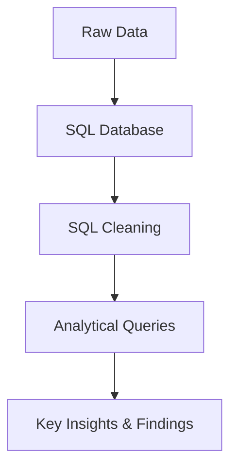

# Layoff Data Analysis & Cleaning Project (Using SQL)


## 📌 Project Overview
This project focuses on analyzing and cleaning a dataset related to layoffs in various industries. Using SQL, we perform data cleaning steps such as handling duplicate values, standardizing data, and ensuring consistency across different fields. The dataset includes company information, location, industry, layoffs, funding, and other relevant details.

## Technology Stack
- **Database Management System**: PostgreSQL
- **Query Language**: SQL (DDL, DML, Aggregations, Joins, Window Functions)
- **Data Source**: Layoff dataset
-  

## 📂 Project Structure
1. **Data Loading & Setup**  
   - Creating the `layoffs` table
   - Creating a `layoff_staging` table for cleaning operations

2. **Data Cleaning & Standardization**  
   - Identifying and removing duplicate records
   - Standardizing company, industry, and country names
   - Handling NULL and inconsistent values
   - Converting date formats
   
3. **Exploratory Data Analysis (EDA)**  
   - Checking data distribution
   - Understanding layoff trends across industries
   - Finding the most affected locations

4. **Findings & Insights**  
   - Summary of key observations from the cleaned dataset

---

## Data Processing Pipeline



---

## 📥 Data Setup
### **Step 1: Create the Table**
```sql
DROP TABLE IF EXISTS layoffs;
CREATE TABLE layoffs 
(
    company VARCHAR(30),
    location VARCHAR(30),
    industry VARCHAR(30),
    total_laid_off INT,
    percentage_laid_off FLOAT,
    layoff_date VARCHAR(30),
    stage VARCHAR(30),
    country VARCHAR(30),
    funds_raised_millions FLOAT
);
```

### **Step 2: Create a Duplicated Table for Cleaning**
```sql
SELECT * INTO layoff_staging
FROM layoffs;
```

---

## Data Cleaning Steps
### **Step 1: Identifying and Removing Duplicate Records**
```sql
SELECT *
FROM (
	SELECT *,
	ROW_NUMBER () OVER (
	PARTITION BY company, location, industry, total_laid_off,percentage_laid_off, 
	layoff_date, stage, country, funds_raised_millions) row_num
	FROM layoff_staging
	)
WHERE row_num > 1;

-- DELETE DUPLICATE ROWS

WITH duplicate_check AS (
    SELECT ctid
    FROM (
        SELECT ctid, 
               ROW_NUMBER() OVER (
                   PARTITION BY company, location, industry, total_laid_off, 
                   percentage_laid_off, layoff_date, stage, country, funds_raised_millions
               ) AS row_num
        FROM layoff_staging
    ) subquery
    WHERE row_num > 1
)
DELETE FROM layoff_staging
WHERE ctid IN (SELECT ctid FROM duplicate_check);
```

### **Step 2: Standardizing Data (Company, Industry, and Country)**
```sql
SELECT DISTINCT(TRIM(company)),
	company
FROM layoff_staging;

UPDATE layoff_staging
SET company = TRIM(company);

--- Update industry column for incosistencies in the values  
SELECT DISTINCT industry
FROM layoff_staging
ORDER BY 1;

UPDATE layoff_staging
SET industry = 'Crypto'
WHERE  industry LIKE 'Crypto%';

--- Update country column for incosistencies in the values  

SELECT DISTINCT country
FROM layoff_staging
ORDER BY 1;

UPDATE layoff_staging
SET country = 'United States'
WHERE country LIKE 'United States%';
```

### **Step 3: Handling NULL values in Industry Column**
```sql
-- Checking for the NULL rows

SELECT *
FROM layoff_staging t1
JOIN layoff_staging t2
ON t1.company = t2.company
WHERE (t1.industry IS NULL) AND t2.industry IS NOT NULL

-- Updating the NULL rows with values
	
UPDATE layoff_staging t1
SET industry = t2.industry
FROM layoff_staging t2
WHERE t1.company = t2.company
  AND (t1.industry IS NULL OR t1.industry = ' ')
  AND t2.industry IS NOT NULL;


SELECT *
	FROM layoff_staging
WHERE company LIKE 'Bally%'

UPDATE layoff_staging
SET industry = NULL
WHERE company LIKE 'Bally%'
```

### **Step 4: Deleting Blank or NULL Values in Layoff Columns**
```sql
DELETE 
FROM layoff_staging
WHERE total_laid_off IS NULL 
  AND percentage_laid_off IS NULL


SELECT * 
FROM layoff_staging
WHERE total_laid_off IS NULL AND percentage_laid_off IS NULL

```

### **Step 5: Converting Layoff Date Column to Proper Date Format**
```sql
ALTER TABLE layoff_staging
ALTER COLUMN layoff_date TYPE DATE
USING TO_DATE(layoff_date, 'MM/DD/YYYY');

SELECT 
    layoff_date,
    TO_DATE(layoff_date, 'MM/DD/YYYY') AS formatted_layoff_date
FROM 
    layoff_staging;

UPDATE layoff_staging
SET layoff_date = TO_DATE(layoff_date, 'MM/DD/YYYY') 
```
---

## 📊 Findings & Insights
- The dataset contained **duplicate records**, which were successfully removed.
- Company names and industry classifications had **inconsistencies**, which were standardized.
- **NULL values** in the industry column were replaced with the correct values based on company names.
- The **layoff_date column was converted** from string format to proper date format.
- The dataset is now **cleaned and structured**, ready for further analysis.
---
# Exploratory Data Analysis (EDA) - Layoffs Dataset

## 1 Basic Data Exploration

### 1.1 Total Records in the Dataset
```sql
SELECT COUNT(*) AS total_records FROM layoff_staging;
```

### 1.2 Number of Unique Companies
```sql
SELECT COUNT(DISTINCT company) AS unique_companies FROM layoff_staging;
```

### 1.3 Number of Unique Industries
```sql
SELECT COUNT(DISTINCT industry) AS unique_industries FROM layoff_staging;
```

### 1.4 Number of Unique Countries
```sql
SELECT COUNT(DISTINCT country) AS unique_countries FROM layoff_staging;
```

### 1.5 Date Range of Layoffs
```sql
SELECT MIN(layoff_date) AS earliest_layoff, MAX(layoff_date) AS latest_layoff 
FROM layoff_staging;
```

## 2 Layoff Trends Over Time

### 2.1 Number of Layoffs Per Year
```sql
SELECT EXTRACT(YEAR FROM layoff_date) AS year, 
       COUNT(*) AS layoff_events, 
       SUM(total_laid_off) AS total_laid_off
FROM layoff_staging
GROUP BY year
ORDER BY year;
```

### 2.2 Monthly Layoff Trend
```sql
SELECT EXTRACT(YEAR FROM layoff_date) AS year,
       EXTRACT(MONTH FROM layoff_date) AS month, 
       SUM(total_laid_off) AS total_laid_off
FROM layoff_staging
GROUP BY year, month
ORDER BY year, month;
```

## 3 Industry-Wise Analysis

### 3.1 Top 5 Industries with the Highest Layoffs
```sql
SELECT industry, SUM(total_laid_off) AS total_laid_off
FROM layoff_staging
GROUP BY industry
ORDER BY total_laid_off DESC
LIMIT 5;
```

### 3.2 Industry-Wise Average Percentage Laid Off
```sql
SELECT industry, ROUND(AVG(percentage_laid_off), 2) AS avg_percentage_laid_off
FROM layoff_staging
GROUP BY industry
ORDER BY avg_percentage_laid_off DESC;
```

## 4 Country-Wise Layoff Analysis

### 4.1 Top 5 Countries with the Highest Layoffs
```sql
SELECT country, SUM(total_laid_off) AS total_laid_off
FROM layoff_staging
GROUP BY country
ORDER BY total_laid_off DESC
LIMIT 5;
```

### 4.2 Average Layoff Percentage by Country
```sql
SELECT country, ROUND(AVG(percentage_laid_off), 2) AS avg_percentage_laid_off
FROM layoff_staging
GROUP BY country
ORDER BY avg_percentage_laid_off DESC;
```

## 5 Company-Wise Analysis

### 5.1 Top 5 Companies with the Highest Layoffs
```sql
SELECT company, SUM(total_laid_off) AS total_laid_off
FROM layoff_staging
GROUP BY company
ORDER BY total_laid_off DESC
LIMIT 5;
```

### 5.2 Companies with Highest Layoff Percentage
```sql
SELECT company, MAX(percentage_laid_off) AS max_percentage_laid_off
FROM layoff_staging
GROUP BY company
ORDER BY max_percentage_laid_off DESC
LIMIT 5;
```

## 6 Funding and Layoffs

### 6.1 Companies with the Highest Funds Raised but Still Laid Off Employees
```sql
SELECT company, funds_raised_millions, SUM(total_laid_off) AS total_laid_off
FROM layoff_staging
GROUP BY company, funds_raised_millions
ORDER BY funds_raised_millions DESC
LIMIT 5;
```

### 6.2 Correlation Between Funds Raised and Layoff Percentage
```sql
SELECT ROUND(CORR(funds_raised_millions, percentage_laid_off), 2) AS correlation 
FROM layoff_staging
WHERE funds_raised_millions IS NOT NULL;
```

(A value close to **-1** means companies that raised more funds still laid off a significant percentage of employees.)

---

## Insights from EDA

- **Peak Layoff Periods:** Identify the months and years with the highest layoffs.
- **Most Affected Industries:** Determine which industries suffered the highest job cuts.
- **Country Trends:** Discover which countries experienced the most layoffs.
- **Top Companies:** Find the companies that laid off the most employees.
- **Funding vs. Layoffs:** Analyze whether high funding led to lower layoffs or if even well-funded companies had to cut jobs.

---

This analysis provides valuable insights into layoff patterns and trends across different industries, countries, and companies. 📊

## 📢 Conclusion
This project demonstrates the importance of **data cleaning and transformation** in SQL before conducting any meaningful analysis. The cleaned dataset can now be used to analyze trends, detect patterns, and make informed business decisions regarding layoffs across industries.

---

## 📌 About Me
Hi, I'm Oluwatosin Amosu Bolaji, a Data Analyst with strong skills in Python, SQL, Power BI, and Excel. I turn raw data into actionable insights through automation, data storytelling, and visual analytics.

- **💡 Tools & Tech:** **Python** (Pandas, NumPy, Matplotlib, Seaborn) | **SQL** (MsSQL, Postgree, MySQL) | **Microsoft Power BI** | **Microsoft Excel**
- **🔹 Key Skills:** Data wrangling, dashboarding, reporting, and process optimization.
-       
-    
-   
- 

#### 🚀 **Always learning. Always building. Data-driven to the core.**  

### 📫 **Let’s connect!**  
- 📩 oluwabolaji60@gmail.com
- 🔗 : [LinkedIn](https://www.linkedin.com/in/oluwatosin-amosu-722b88141)
- 🌐 : [My Portfolio](https://www.datascienceportfol.io/oluwabolaji60) 
- 𝕏 : [Twitter/X](https://x.com/thee_oluwatosin?s=21&t=EqoeQVdQd038wlSUzAtQzw)
- 🔗 : [Medium](https://medium.com/@oluwabolaji60)
- 🔗 : [View my Repositories](https://github.com/Tbrown1998?tab=repositories)

